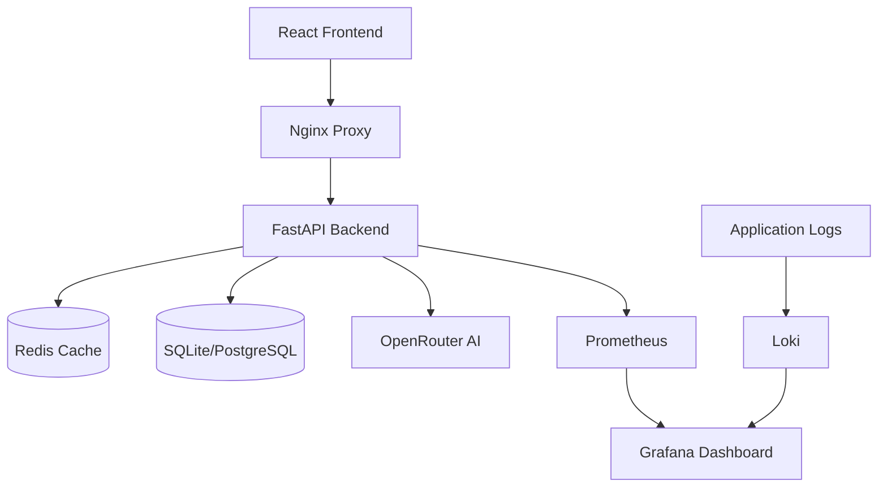

# 🚀 Baby AI - Professional Baby Name Generator

[](https://github.com/your-repo/baby-ai)
[](LICENSE)
[](docker-compose.yml)
[](https://redis.io/)
[](https://fastapi.tiangolo.com/)

## 🎯 **Overview**

Baby AI is a professional-grade, AI-powered baby name generator that supports multiple languages and cultures. Built with enterprise-level architecture, it features advanced caching, rate limiting, comprehensive monitoring, and scalable infrastructure.

### ✨ **Key Features**

🤖 **AI-Powered Generation** - Advanced name suggestions using Claude 3 Haiku
🌍 **Multi-Cultural Support** - Turkish, English, Arabic, Persian, and more
🚀 **Enterprise Ready** - Redis caching, rate limiting, monitoring
🔒 **Security First** - JWT with refresh tokens, OWASP compliance
📊 **Analytics & Monitoring** - Prometheus, Grafana, structured logging
⚡ **High Performance** - Optimized database queries, connection pooling
🎨 **Modern UI** - React with Tailwind CSS, mobile-responsive
💳 **Subscription System** - Tiered plans with usage tracking
🛡️ **Professional Auth** - Session management, account security
📈 **Scalable Architecture** - Docker-based, horizontally scalable

---

## 🏗️ **Architecture Overview**



### **Technology Stack**

| Component | Technology | Purpose |
|-----------|------------|---------|
| **Backend** | FastAPI + Python 3.11 | High-performance async API |
| **Frontend** | React 18 + Vite | Modern SPA with fast builds |
| **Database** | SQLite/PostgreSQL | Primary data storage |
| **Cache** | Redis 7.0 | Caching and rate limiting |
| **AI Service** | OpenRouter API | Name generation using Claude |
| **Monitoring** | Prometheus + Grafana | Metrics and dashboards |
| **Logging** | Structured logging + Loki | Centralized log management |
| **Containerization** | Docker + Docker Compose | Easy deployment |

---

## 🚀 **Quick Start**

### **Prerequisites**

- Docker & Docker Compose
- OpenRouter API key ([Get one here](https://openrouter.ai/))
- Node.js 18+ (for development)
- Python 3.11+ (for development)

### **1. Clone & Setup**

```bash
git clone https://github.com/your-repo/baby-ai.git
cd baby-ai

# Copy environment file
cp env.example .env

# Edit .env file with your settings
nano .env
```

### **2. Configure Environment**

**Required Settings:**
```bash
# OpenRouter AI API Key
OPENROUTER_API_KEY=your-openrouter-api-key-here

# Security (change in production!)
SECRET_KEY=your-super-secret-key-minimum-32-characters

# Environment
ENVIRONMENT=development
DEBUG=true
```

### **3. Start Services**

```bash
# Start all services
docker-compose up -d

# View logs
docker-compose logs -f

# Health check
curl http://localhost:8000/health
```

### **4. Access Applications**

| Service | URL | Purpose |
|---------|-----|---------|
| **Frontend** | http://localhost:5173 | Main application |
| **API Docs** | http://localhost:8000/docs | Interactive API documentation |
| **API Health** | http://localhost:8000/health | Health check endpoint |
| **Redis Insight** | http://localhost:8001 | Redis monitoring (dev mode) |

---

## 🔧 **Development Setup**

### **Backend Development**

```bash
cd backend

# Create virtual environment
python -m venv venv
source venv/bin/activate  # On Windows: venv\Scripts\activate

# Install dependencies
pip install -r requirements.txt

# Run development server
python -m app.main_professional
```

### **Frontend Development**

```bash
cd frontend

# Install dependencies
npm install

# Start development server
npm run dev
```

### **Environment Variables**

Create `.env` file in the root directory:

```bash
# Essential settings
OPENROUTER_API_KEY=your-api-key
SECRET_KEY=your-secret-key
ENVIRONMENT=development

# Redis (for caching and rate limiting)
REDIS_URL=redis://localhost:6379/0

# Database
DATABASE_URL=sqlite:///./baby_names.db

# Rate limiting
RATE_LIMIT_ENABLED=true
RATE_LIMIT_CALLS=100
RATE_LIMIT_PERIOD=60
```

---

## 📊 **Professional Features**

### **1. Advanced Rate Limiting**

- **Redis-based**: Distributed rate limiting across instances
- **User Tiers**: Different limits for anonymous, registered, premium, admin
- **Endpoint-specific**: Custom limits per API endpoint
- **Graceful Degradation**: Continues working when Redis is unavailable

```python
# Rate limits by user tier
ANONYMOUS_USER: 50 requests/hour
REGISTERED_USER: 100 requests/hour  
PREMIUM_USER: 1000 requests/hour
ADMIN_USER: 10000 requests/hour
```

### **2. Comprehensive Authentication**

- **JWT with Refresh Tokens**: Secure, stateless authentication
- **Session Management**: Track active sessions, device info
- **Account Security**: Failed login tracking, account locking
- **Token Blacklisting**: Revoke compromised tokens
- **Audit Logging**: Complete user action tracking

### **3. Professional Caching**

- **Multi-layer Caching**: Redis + application-level caching
- **Smart Cache Keys**: Hierarchical, expiring cache strategy
- **Cache Warming**: Pre-populate popular data
- **Cache Analytics**: Hit rates, performance metrics

### **4. Enterprise Monitoring**

```yaml
Metrics Collected:
- API response times
- Cache hit rates  
- User registrations
- Name generations
- Error rates
- Resource usage
```

### **5. Database Optimization**

- **Composite Indexes**: Optimized for common query patterns
- **Connection Pooling**: Efficient database connections
- **Soft Deletes**: Data retention and recovery
- **Partitioning Ready**: Large-scale data handling

---

## 🛡️ **Security Features**

### **OWASP Compliance**

✅ **A01: Broken Access Control** - Role-based access with JWT
✅ **A02: Cryptographic Failures** - bcrypt hashing, secure tokens
✅ **A03: Injection** - SQLAlchemy ORM, input validation
✅ **A04: Insecure Design** - Security-first architecture
✅ **A05: Security Misconfiguration** - Secure defaults
✅ **A06: Vulnerable Components** - Regular dependency updates
✅ **A07: Authentication Failures** - Account lockout, strong auth
✅ **A08: Software Integrity** - Code signing, validation
✅ **A09: Logging Failures** - Comprehensive audit logs
✅ **A10: Server-Side Request Forgery** - Input validation

### **Security Headers**

```http
X-Content-Type-Options: nosniff
X-Frame-Options: DENY
X-XSS-Protection: 1; mode=block
Strict-Transport-Security: max-age=31536000; includeSubDomains
Content-Security-Policy: default-src 'self'
```

### **Data Protection**

- **GDPR Compliance**: Right to deletion, data portability
- **Data Encryption**: At rest and in transit
- **Privacy by Design**: Minimal data collection
- **Anonymization**: IP address anonymization options

---

## 📈 **Performance Optimization**

### **Backend Optimizations**

```python
# Database query optimization
- Composite indexes on frequent queries
- Connection pooling (10-20 connections)
- Query result caching
- Lazy loading relationships

# Redis caching strategy
- Popular names cached for 6 hours
- User sessions cached for 7 days
- Rate limit counters with TTL
- Analytics data aggregation

# API performance
- Async/await throughout
- Request size limits (10MB)
- Response compression (gzip)
- Connection keep-alive
```

### **Frontend Optimizations**

```javascript
// React performance
- Code splitting with React.lazy()
- Memo for expensive components
- Virtual scrolling for large lists
- Image lazy loading

// Build optimization
- Vite for fast builds
- Bundle size analysis
- Tree shaking
- CSS purging with Tailwind
```

### **CDN & Static Assets**

```bash
# Recommended CDN setup
- Static assets: CSS, JS, images
- Font loading optimization
- Image compression and WebP
- Browser caching headers
```

---

## 🐳 **Deployment**

### **Docker Production Setup**

```bash
# Production deployment
docker-compose -f docker-compose.prod.yml up -d

# With monitoring stack
docker-compose --profile production --profile monitoring up -d
```

### **Environment-Specific Configs**

```bash
# Development
ENVIRONMENT=development
DEBUG=true
HTTPS_ONLY=false

# Staging  
ENVIRONMENT=staging
DEBUG=false
HTTPS_ONLY=true

# Production
ENVIRONMENT=production
DEBUG=false
HTTPS_ONLY=true
SECURITY_HEADERS_ENABLED=true
```

### **Scaling Considerations**

**Horizontal Scaling:**
```yaml
# Load balancer configuration
backend:
  deploy:
    replicas: 3
    resources:
      limits:
        memory: 512M
        cpus: '0.5'
```

**Database Scaling:**
```sql
-- PostgreSQL partitioning for large tables
CREATE TABLE name_generations_y2024m01 PARTITION OF name_generations
FOR VALUES FROM ('2024-01-01') TO ('2024-02-01');

-- Read replicas for heavy read workloads
-- Master-slave replication setup
```

---

## 📊 **Monitoring & Analytics**

### **Health Checks**

```bash
# Application health
GET /health
{
  "status": "healthy",
  "timestamp": "2024-01-15T10:00:00Z",
  "version": "2.0.0"
}

# Detailed health (admin only)
GET /health/detailed
{
  "status": "healthy",
  "services": {
    "database": {"status": "healthy"},
    "redis": {"status": "healthy"},
    "ai_service": {"status": "healthy"}
  },
  "metrics": {
    "total_users": 1250,
    "active_sessions": 45,
    "cache_hit_rate": "95%"
  }
}
```

### **Metrics Dashboard**

Access Grafana at `http://localhost:3001` (admin/admin)

**Key Metrics:**
- API response times (p50, p95, p99)
- User registrations and activity
- Name generation success rates
- Cache performance
- Error rates by endpoint
- Resource utilization

### **Log Analysis**

```bash
# Structured JSON logs
{
  "timestamp": "2024-01-15T10:00:00Z",
  "level": "INFO",
  "logger": "app.services",
  "message": "Name generation completed",
  "user_id": 123,
  "response_time_ms": 245,
  "extra": {
    "request_id": "req_abc123",
    "gender": "female",
    "language": "turkish"
  }
}
```

---

## 💳 **Subscription System**

### **Pricing Tiers**

| Plan | Price | Daily Generations | Features |
|------|-------|-------------------|----------|
| **Free** | $0/month | 10 | Basic names |
| **Premium** | $9.99/month | 100 | Advanced features, analytics |
| **Pro** | $19.99/month | Unlimited | API access, priority support |

### **Implementation**

```python
# Subscription checking
@require_premium
async def advanced_features(user: User):
    if not user.is_premium_active():
        raise HTTPException(403, "Premium required")
    
# Usage tracking
async def track_usage(user: User, operation: str):
    await redis_manager.increment(
        f"usage:{user.id}:{date.today()}:{operation}"
    )
```

---

## 🔧 **API Documentation**

### **Interactive Documentation**

- **Swagger UI**: http://localhost:8000/docs
- **ReDoc**: http://localhost:8000/redoc
- **OpenAPI Schema**: http://localhost:8000/api/openapi.json

### **Key Endpoints**

```http
# Authentication
POST /auth/register        # User registration
POST /auth/login          # User login  
POST /auth/refresh        # Refresh token

# Name Generation
POST /generate            # Generate names
GET /popular              # Popular names
GET /trends               # Name trends

# User Management
GET /profile              # User profile
POST /favorites           # Add to favorites
GET /favorites            # List favorites

# Admin
GET /admin/users          # List users (admin)
GET /admin/analytics      # System analytics
```

### **Authentication**

```javascript
// Frontend authentication
const response = await fetch('/auth/login', {
  method: 'POST',
  headers: {
    'Content-Type': 'application/json',
  },
  body: JSON.stringify({
    email: 'user@example.com',
    password: 'password123'
  })
});

const { access_token, refresh_token } = await response.json();

// Use access token in subsequent requests
fetch('/generate', {
  headers: {
    'Authorization': `Bearer ${access_token}`
  }
});
```

---

## 🧪 **Testing**

### **Run Tests**

```bash
# Backend tests
cd backend
python -m pytest tests/ -v

# Frontend tests  
cd frontend
npm run test

# Integration tests
npm run test:e2e

# Load testing
cd backend
locust -f tests/load_test.py --host=http://localhost:8000
```

### **Test Coverage**

```bash
# Generate coverage report
python -m pytest --cov=app tests/
coverage html
open htmlcov/index.html
```

---

## 🔍 **Troubleshooting**

### **Common Issues**

**Redis Connection Failed:**
```bash
# Check Redis status
docker-compose ps redis
docker-compose logs redis

# Restart Redis
docker-compose restart redis
```

**Database Locks:**
```bash
# SQLite lock issues
rm baby_names.db-wal baby_names.db-shm

# PostgreSQL connection issues
docker-compose restart postgres
```

**High Memory Usage:**
```bash
# Monitor resource usage
docker stats

# Adjust container limits
docker-compose up --scale backend=2
```

### **Performance Issues**

```bash
# Enable debug mode
export DEBUG_SQL=true
export DEBUG_REDIS=true
export DEBUG_AI_REQUESTS=true

# Monitor slow queries
tail -f logs/app.log | grep "slow_operation"

# Check cache hit rates
curl http://localhost:8000/admin/analytics
```

---

## 🤝 **Contributing**

### **Development Workflow**

1. **Fork the repository**
2. **Create feature branch**: `git checkout -b feature/amazing-feature`
3. **Make changes** with tests
4. **Run test suite**: `npm run test:all`
5. **Commit changes**: `git commit -m 'Add amazing feature'`
6. **Push to branch**: `git push origin feature/amazing-feature`
7. **Open Pull Request**

### **Code Standards**

```bash
# Python code formatting
black app/
isort app/
flake8 app/

# JavaScript/React formatting  
npm run lint
npm run format

# Type checking
mypy app/
npm run type-check
```

---

## 📞 **Support**

### **Documentation**

- **API Docs**: http://localhost:8000/docs
- **Architecture Guide**: [ARCHITECTURE.md](ARCHITECTURE.md)
- **Security Guide**: [SECURITY.md](SECURITY.md)
- **Deployment Guide**: [DEPLOYMENT.md](DEPLOYMENT.md)

### **Community**

- **GitHub Issues**: [Report bugs](https://github.com/your-repo/baby-ai/issues)
- **Discussions**: [Ask questions](https://github.com/your-repo/baby-ai/discussions)
- **Email**: support@yourdomain.com

---

## 📄 **License**

This project is licensed under the MIT License - see the [LICENSE](LICENSE) file for details.

---

## 🙏 **Acknowledgments**

- **OpenRouter AI** for powerful AI models
- **FastAPI** for excellent async framework
- **Redis** for high-performance caching
- **React & Tailwind** for modern UI
- **Docker** for containerization
- **Prometheus & Grafana** for monitoring

---

<div align="center">

**🚀 Built with ❤️ for modern families**

[Demo](https://your-demo-url.com) • [Documentation](https://docs.your-domain.com) • [Support](mailto:support@your-domain.com)

</div> 