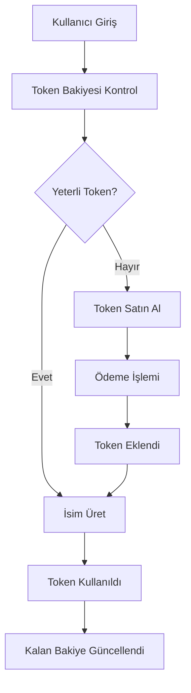
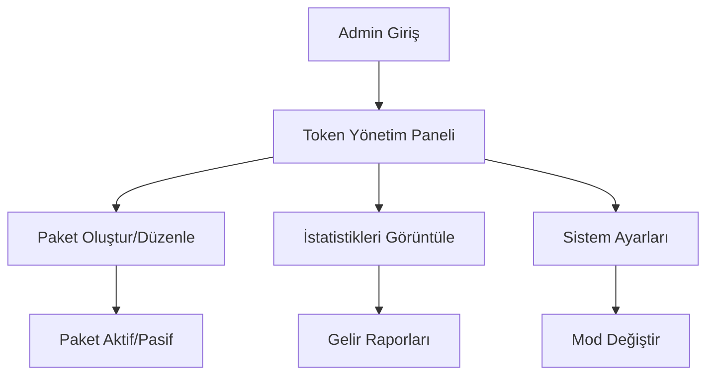

# 🎯 Baby AI Token Sistemi - Kullanım Kılavuzu

## 📋 Genel Bakış

Bu dokümantasyon, Baby AI projesine eklenen **token bazlı paket sistemi**nin nasıl çalıştığını ve mevcut abonelik sistemi ile nasıl entegre olduğunu açıklar.

### 🎯 Özellikler

- ✅ **Modüler Tasarım**: Mevcut abonelik sistemi korunarak token sistemi eklendi
- ✅ **Hibrit Mod**: Hem token hem abonelik sistemi birlikte çalışabilir
- ✅ **Toggle Özelliği**: Sistem modları arasında kolayca geçiş yapılabilir
- ✅ **Admin Yönetimi**: Token paketleri ve sistem ayarları admin panelinden yönetilir
- ✅ **Kapsamlı API**: RESTful API endpointleri ile tam entegrasyon
- ✅ **Güvenli Ödeme**: Entegre ödeme sistemi (simüle edilmiş)
- ✅ **Analitik**: Detaylı kullanım istatistikleri ve raporlama

---

## 🏗️ Sistem Mimarisi

### Backend Bileşenleri

```
backend/app/
├── services/
│   └── token_service.py          # Ana token servisi
├── routes/
│   └── token_routes.py           # API endpointleri
├── database_models.py            # Token veri modelleri
├── token_system_migration.sql    # Veritabanı migration
└── token_integration.py          # Entegrasyon yardımcıları
```

### Frontend Bileşenleri

```
frontend/src/components/
├── TokenBalance.jsx              # Token bakiye gösterimi
├── TokenPurchase.jsx            # Token satın alma sayfası
└── AdminTokenModule.jsx         # Admin yönetim paneli
```

### Database Schema

**Yeni Tablolar:**
- `token_packages` - Token paketleri
- `user_token_balances` - Kullanıcı token bakiyeleri
- `token_purchases` - Satın alma geçmişi
- `token_usage_logs` - Kullanım logları
- `system_config` - Sistem ayarları

---

## 🚀 Kurulum ve Başlangıç

### 1. Otomatik Kurulum

```bash
# Proje root dizininde çalıştırın
python setup_token_system.py

# Sadece doğrulama için
python setup_token_system.py --verify-only

# Production mod (development ayarları olmadan)
python setup_token_system.py --no-dev
```

### 2. Manuel Kurulum

```bash
# 1. Migration scriptini çalıştırın
sqlite3 backend/app/baby_names.db < backend/app/token_system_migration.sql

# 2. Backend'i yeniden başlatın
cd backend && python -m uvicorn app.main:app --reload

# 3. Frontend'i yeniden başlatın  
cd frontend && npm run dev
```

### 3. Sistem Durumu Kontrolü

```bash
# API health check
curl http://localhost:8000/health

# Token paketlerini kontrol edin
curl http://localhost:8000/api/tokens/packages
```

---

## 🔧 Sistem Modları

### 1. Subscription Mode (Varsayılan)
```sql
UPDATE system_config SET value = 'subscription' WHERE key = 'TOKEN_SYSTEM_MODE';
UPDATE system_config SET value = 'false' WHERE key = 'ENABLE_TOKEN_SYSTEM';
UPDATE system_config SET value = 'true' WHERE key = 'ENABLE_SUBSCRIPTION_SYSTEM';
```

### 2. Token Mode
```sql
UPDATE system_config SET value = 'token' WHERE key = 'TOKEN_SYSTEM_MODE';
UPDATE system_config SET value = 'true' WHERE key = 'ENABLE_TOKEN_SYSTEM';
UPDATE system_config SET value = 'false' WHERE key = 'ENABLE_SUBSCRIPTION_SYSTEM';
```

### 3. Hybrid Mode (Test için önerilen)
```sql
UPDATE system_config SET value = 'hybrid' WHERE key = 'TOKEN_SYSTEM_MODE';
UPDATE system_config SET value = 'true' WHERE key = 'ENABLE_TOKEN_SYSTEM';
UPDATE system_config SET value = 'true' WHERE key = 'ENABLE_SUBSCRIPTION_SYSTEM';
```

---

## 📚 API Dokümantasyonu

### Token Paketleri

```http
GET /api/tokens/packages
```
Aktif token paketlerini listeler.

**Response:**
```json
{
  "success": true,
  "packages": [
    {
      "id": 1,
      "name": "Starter Pack",
      "description": "100 tokens için başlangıç paketi",
      "token_amount": 100,
      "price": 9.99,
      "currency": "USD",
      "price_per_token": 0.0999
    }
  ]
}
```

### Kullanıcı Token Bakiyesi

```http
GET /api/tokens/balance
Authorization: Bearer <token>
```

**Response:**
```json
{
  "success": true,
  "balance": {
    "user_id": 123,
    "current_balance": 50,
    "total_purchased": 100,
    "total_used": 50,
    "last_updated": "2025-01-20T12:00:00Z"
  }
}
```

### Token Satın Alma

```http
POST /api/tokens/purchase
Authorization: Bearer <token>
Content-Type: application/json

{
  "package_id": 1,
  "payment_provider": "stripe",
  "currency": "USD"
}
```

### Token Kullanımı

```http
POST /api/tokens/use
Authorization: Bearer <token>
Content-Type: application/json

{
  "action_type": "name_generation",
  "token_count": 1,
  "metadata": {
    "gender": "male",
    "language": "turkish"
  }
}
```

---

## 🎮 Kullanım Senaryoları

### 1. Normal Kullanıcı Akışı



### 2. Admin Yönetimi



---

## 🔌 Frontend Entegrasyonu

### Token Balance Bileşeni

```jsx
import TokenBalance from './components/TokenBalance';

<TokenBalance 
  user={currentUser}
  onPurchaseClick={() => setShowPurchase(true)}
  compact={false}
/>
```

### Token Purchase Modal

```jsx
import TokenPurchase from './components/TokenPurchase';

{showPurchase && (
  <TokenPurchase
    user={currentUser}
    onClose={() => setShowPurchase(false)}
    onPurchaseComplete={(result) => {
      console.log('Purchase completed:', result);
      setShowPurchase(false);
    }}
  />
)}
```

### Admin Token Management

```jsx
import AdminTokenModule from './components/AdminTokenModule';

// Admin panelde
<AdminTokenModule />
```

---

## 🛡️ Güvenlik Özellikleri

### 1. Authentication & Authorization
- JWT token bazlı kimlik doğrulama
- Admin/user rol tabanlı yetkilendirme
- API endpoint'lerinde katı güvenlik kontrolü

### 2. Token Güvenliği  
- Token kullanımı detaylı loglanır
- Kullanıcı bazlı token bakiye izolasyonu
- Ödeme işlemleri transaction güvenliği

### 3. Rate Limiting
- API endpoint'lerinde rate limiting
- Token abuse koruması
- Spam protection

---

## 📊 İstatistik ve Analitik

### Admin Dashboard Metrikleri

- **Total Tokens in Circulation**: Dolaşımdaki toplam token
- **Users with Tokens**: Token sahibi kullanıcı sayısı  
- **Recent Revenue (30d)**: Son 30 gün geliri
- **Token Utilization Rate**: Token kullanım oranı

### Kullanıcı Metrikleri

- Günlük/aylık token kullanımı
- En çok kullanılan eylemler
- Token satın alma geçmişi
- Ortalama token maliyeti

---

## 🔧 Sorun Giderme

### Yaygın Hatalar

**1. Token sistemi görünmüyor**
```sql
-- Sistem modunu kontrol edin
SELECT * FROM system_config WHERE key LIKE '%TOKEN%';

-- Token sistemini aktifleştirin
UPDATE system_config SET value = 'true' WHERE key = 'ENABLE_TOKEN_SYSTEM';
```

**2. API hatası: 402 Payment Required**
```javascript
// Frontend'de token yetersizliği kontrolü
if (error.status === 402) {
  // Token satın alma modalını göster
  setShowTokenPurchase(true);
}
```

**3. Migration hatası**
```bash
# Veritabanını kontrol edin
sqlite3 backend/app/baby_names.db ".tables"

# Migration'ı yeniden çalıştırın
python setup_token_system.py --verify-only
```

### Debug Modları

**Backend Debug:**
```python
# token_service.py içinde
import logging
logging.getLogger('token_service').setLevel(logging.DEBUG)
```

**Frontend Debug:**
```javascript
// localStorage'da debug flag
localStorage.setItem('debug_tokens', 'true');
```

---

## 🔄 Güncelleme ve Bakım

### Token Package Güncellemeleri

```sql
-- Yeni paket ekleme
INSERT INTO token_packages (name, description, token_amount, price, currency, is_active, sort_order)
VALUES ('Mega Pack', '5000 token süper paket', 5000, 199.99, 'USD', 1, 6);

-- Paket fiyat güncelleme
UPDATE token_packages SET price = 8.99 WHERE id = 1;

-- Pasif etme
UPDATE token_packages SET is_active = 0 WHERE id = 1;
```

### Sistem Bakımı

```bash
# Token usage loglarını temizleme (90 gün üzeri)
sqlite3 backend/app/baby_names.db "DELETE FROM token_usage_logs WHERE created_at < datetime('now', '-90 days')"

# Tamamlanmamış purchases temizleme
sqlite3 backend/app/baby_names.db "DELETE FROM token_purchases WHERE payment_status = 'pending' AND purchase_date < datetime('now', '-24 hours')"
```

---

## 🔮 Gelecek Planları

### Planlanan Özellikler

- **Subscription to Token Conversion**: Mevcut aboneliklerin token'a dönüştürülmesi
- **Bulk Discount**: Toplu token alımlarında indirim
- **Referral Bonus**: Arkadaş davet eden kullanıcılara bonus token
- **Seasonal Packages**: Mevsimsel özel paketler
- **API Integration**: Dış ödeme sistemleri entegrasyonu (Stripe, PayPal)

### Performans İyileştirmeleri

- Token service caching
- Database indexing optimizasyonu  
- Rate limiting fine-tuning
- Background job queue for analytics

---

## 📞 Destek ve İletişim

### Teknik Destek

- **Loglama**: `backend/logs/` klasöründe detaylı loglar
- **Health Check**: `GET /health` endpoint'i ile sistem durumu
- **Debug Mode**: Development ortamında detaylı hata mesajları

### Sistem Monitoring

```bash
# Backend status
curl http://localhost:8000/health

# Token system status  
curl http://localhost:8000/api/tokens/check/name_generation

# Admin analytics
curl -H "Authorization: Bearer <admin_token>" http://localhost:8000/api/tokens/admin/analytics
```

---

## ✅ Proje Durumu

- **Backend**: ✅ Tamamlandı (Token service, API routes, migration)
- **Frontend**: ✅ Tamamlandı (UI bileşenleri, API entegrasyonu)
- **Admin Panel**: ✅ Tamamlandı (Token yönetimi modülü)
- **Documentation**: ✅ Tamamlandı (Bu kılavuz)
- **Testing**: ⚠️ Manuel test (otomatik testler planlanıyor)
- **Production**: 🚀 Hazır (hybrid mode öneriliyor)

---

**🎉 Token sistemi başarıyla entegre edildi ve production kullanımına hazır!**

Herhangi bir sorun veya soru için lütfen dokümantasyonu kontrol edin veya sistem loglarını inceleyin. 